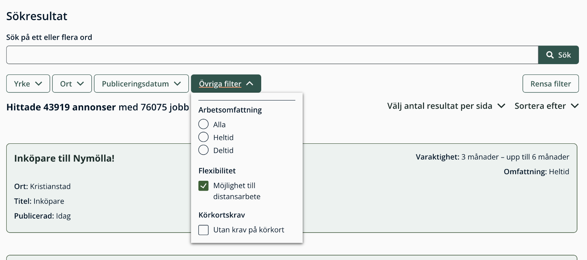

Plastbanken was a group assignment in the advanced JavaScript course at the Front End Development program at Medieinstitutet Stockholm.
It features data from Arbetsförmedlingens API JobSearch that is rendered using their design system.

## Project Overview

The user can

- search the API for available jobs and ads using custom search terms
- filter the search results based on:
  -- location (region and municipality)
  -- working field and specific titles
  -- date of publication
  -- remote, in office or hybrid work
  -- driving license required or not
  -- employment type (i.e part time or full time)
  -- contract type (i.e permanent or fixed-term)
- choose the number of ads displayed on the page
- click on an ad to view its full details

## Technologies and Dependencies

- Vite
- React
- axios
- Prettier
- EsLint
- JavaScript
- TypeScript
- CSS
- Arbetsförmedlingen Design System: Used to ensure consistent UI components and styling across the application

### Screenshots

|                                                               |                                                           |
| ------------------------------------------------------------- | --------------------------------------------------------- |
|                |                          |
|             |                  |
|                |            |
|  |  |
|   |       |
|                      |        |

## Contributors

- [Johan Törmä](https://github.com/JT350120)
- [Oskar Landström](https://github.com/olandstorm)
- [Sara Gadeberg](https://github.com/SaraGdbg)
- [Simon Stenström](https://github.com/bucky-13)
